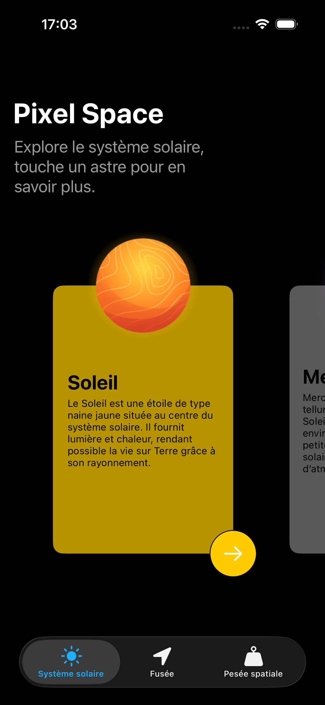
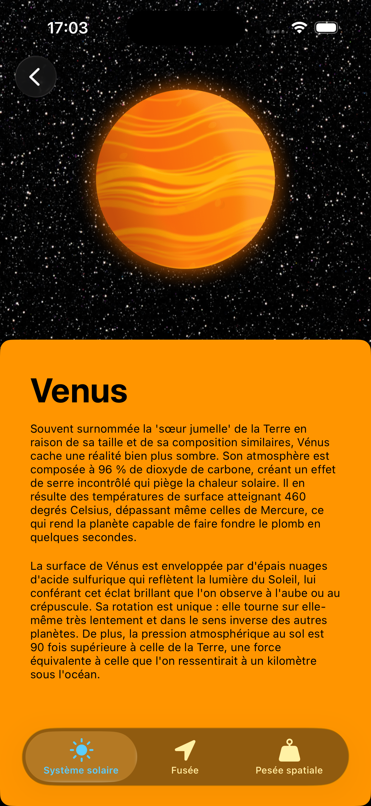
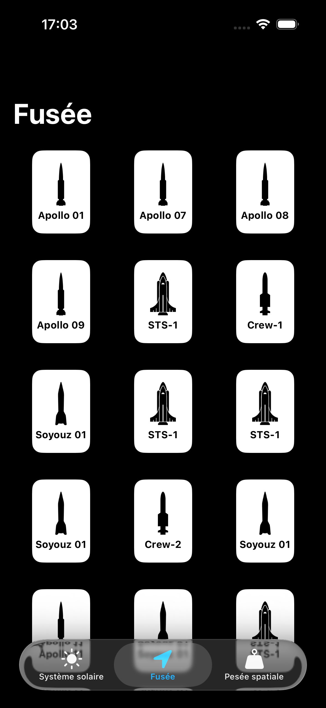
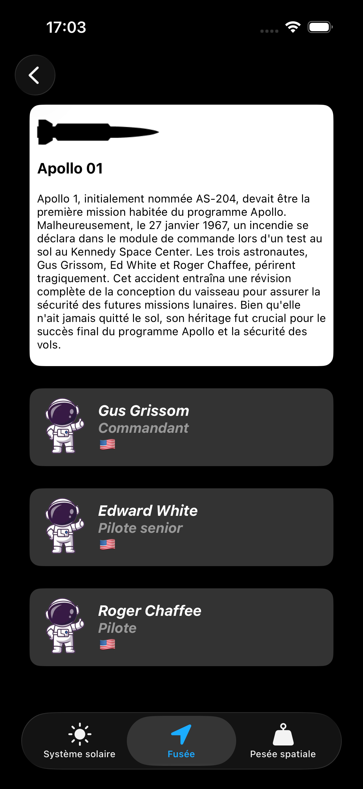
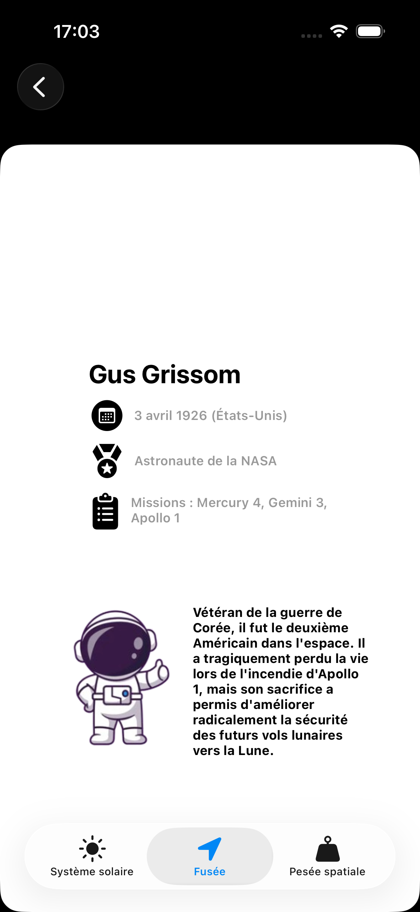
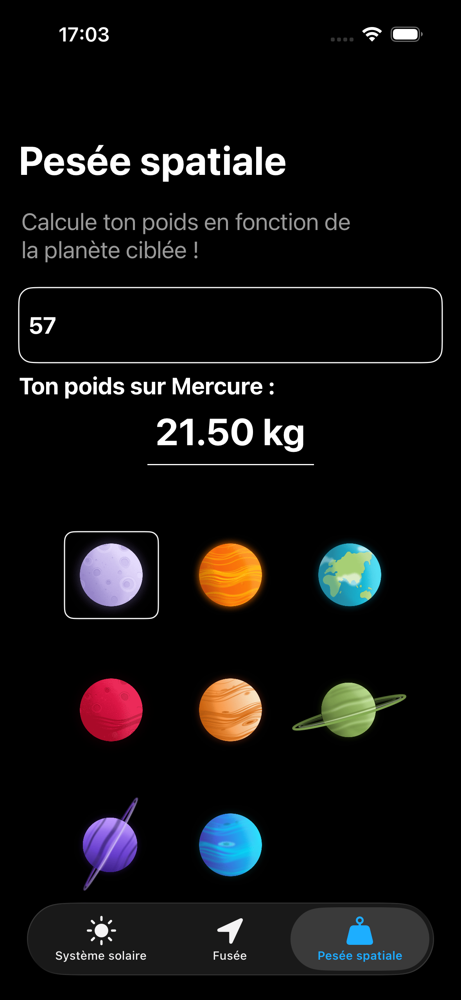

# Pixel Space 🚀 — Explorez le Système Solaire

**Pixel Space** est une application iOS éducative et immersive développée avec **SwiftUI**. Elle permet aux utilisateurs de voyager à travers notre système solaire, de découvrir l'histoire des astronautes célèbres et des fusées iconiques, tout en proposant des outils interactifs comme le calculateur de poids spatial.

---

## 🎨 Conception & Design
Ce projet est une **reproduction technique fidèle d'une maquette Figma** (conçue par un tiers). L'objectif principal était de traduire des concepts visuels complexes en une interface fluide et performante en utilisant les dernières technologies d'Apple.

* **Cible :** iPhone 16 (optimisé pour la résolution et les safe areas des derniers modèles).
* **Design :** Mode sombre natif (Dark Mode) pour une immersion spatiale totale.

---

## 🏗 Architecture & Structure
L'application utilise l'architecture **MVVM (Model-View-ViewModel)** couplée à une couche **Services**. Cette structure assure une séparation stricte entre les données brutes, la logique métier et l'interface utilisateur.

### 📂 Hiérarchie des dossiers
```text
PixelSpace/
├── PixelSpaceApp.swift      # Point d'entrée de l'application
├── Models/                  # Structures de données pures
│   ├── Astronaut.swift
│   ├── Planet.swift
│   └── RocketShip.swift
├── ViewModels/              # Logique métier et gestion d'état (@Observable)
│   ├── SolarSystemListViewModel.swift
│   ├── RocketListViewModel.swift
│   └── SpatialWeighingViewModel.swift
├── Views/                   # Écrans principaux (UI)
│   ├── LandingScreenView.swift
│   ├── SolarSystemListView.swift
│   ├── SolarSystemDetailView.swift
│   ├── RocketListView.swift
│   ├── RocketDetailView.swift
│   ├── AstronautDetailView.swift
│   └── SpatialWeighingView.swift
├── Components/              # Composants UI réutilisables (Cards)
│   ├── PlanetCard.swift
│   ├── RocketCard.swift
│   └── AstronautCard.swift
├── Services/                # Sources de données (Logique d'accès)
│   ├── PlanetService.swift
│   ├── RocketShipService.swift
│   └── AstronautService.swift
├── Extensions/              # Extensions Swift (Styles, Couleurs)
│   └── ColorExtensions.swift
└── Assets.xcassets          # Ressources (Images et Couleurs sémantiques)
```

---

## ✨ Fonctionnalités

- 🪐 **Exploration des Astres :** Découvrez des fiches détaillées sur les planètes avec des visuels haute définition.
- 👨‍🚀 **Héros de l'Espace :** Une base de données des astronautes célèbres, incluant leurs missions et biographies.
- 🚀 **Archives de Fusées :** Explorez les différents modèles de lanceurs, de la capsule Apollo aux navettes STS.
- ⚖️ **Pesée Spatiale :** Un outil interactif pour calculer instantanément votre poids sur n'importe quel astre.
- 📱 **Interface Adaptative :** Utilisation des couleurs sémantiques et du Dynamic Type pour l'accessibilité.

---

## 📸 Aperçu de l'application

<table style="width: 100%;">
  <tr>
    <td align="center" width="33%">
      <br />
      <sub>Accueil & Système Solaire</sub>
    </td>
    <td align="center" width="33%">
      <br />
      <sub>Détail de Vénus</sub>
    </td>
    <td align="center" width="33%">
      <br />
      <sub>Archives des Fusées</sub>
    </td>
  </tr>
  <tr>
    <td align="center" width="33%">
      <br />
      <sub>Fiche technique Apollo 01</sub>
    </td>
    <td align="center" width="33%">
      <br />
      <sub>Biographie Astronaute</sub>
    </td>
    <td align="center" width="33%">
      <br />
      <sub>Calculateur de Poids</sub>
    </td>
  </tr>
</table>

---

## 🛠 Technologies utilisées

- **Langage :** Swift 6.0
- **Framework UI :** SwiftUI
- **Architecture :** MVVM
- **Gestion d'état :** Framework Observation (@Observable)
- **Version iOS :** iOS 18+

---

## 🚀 Installation

1. Clonez le dépôt.
2. Ouvrez `PixelSpace.xcodeproj` dans Xcode.
3. Sélectionnez un simulateur (iPhone 16 recommandé).
4. `Cmd + R` pour lancer l'application.
